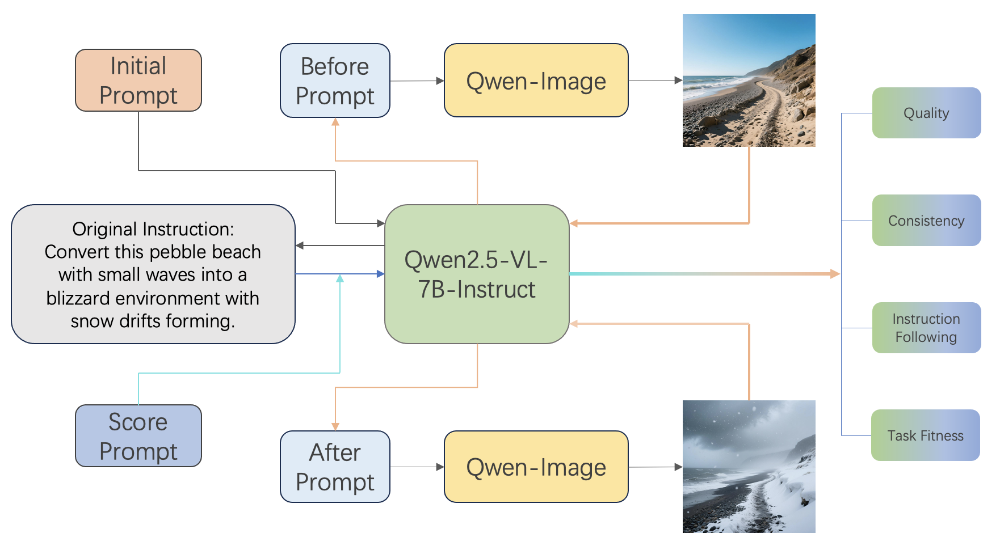

<p align="center">
  
</p>

# A multimodal model focusing on terrain image data augmentation
We present TERRA_BAGEL, an open‑source multimodal model with 7B active parameters trained on large‑scale generated terrain data and corresponding prompts. The original data can be found here: [weather](https://huggingface.co/datasets/Gokottaw434/TerraWeather), [light](https://huggingface.co/datasets/Gokottaw434/TerraLight), [scene](https://huggingface.co/datasets/Gokottaw434/TerraScene); filtered data can be found here: [weather](https://huggingface.co/datasets/ledeix/TerraWeather_filtered), [light](https://huggingface.co/datasets/ledeix/TerraLight_filtered), [scene](https://huggingface.co/datasets/ledeix/TerraScene_filtered). TERRA_BAGEL is initialized from [BAGEL](https://github.com/ByteDance-Seed/Bagel) and trained for about 3 epochs.

## Data Pipeline
<p align="center">
  
</p>

## 🔥 Quick Start
1️⃣  Set up environment \
With requiremets2.txt:
```bash
git clone https://github.com/Ledeix/TerraBagel.git
cd TerraBagel
conda create -n bagel python=3.10 -y
conda activate bagel
pip install -r requirements2.txt
```
If this encounteres problem, try:
```bash
git clone https://github.com/Ledeix/TerraBagel.git
cd TerraBagel
conda create -n bagel python=3.10 -y
conda activate bagel
pip install -r requirements.txt
pip install flash_attn==2.5.8 --no-build-isolation
```
Or with environment.yml:
```bash
git clone https://github.com/Ledeix/TerraBagel.git
cd TerraBagel
conda env create -f environment.yml
conda activate bagel
```

2️⃣  Download pretrained checkpoint of BAGEL
```python
from huggingface_hub import snapshot_download

save_dir = "models/BAGEL-7B-MoT"
repo_id = "ByteDance-Seed/BAGEL-7B-MoT"
cache_dir = save_dir + "/cache"

snapshot_download(cache_dir=cache_dir,
  local_dir=save_dir,
  repo_id=repo_id,
  local_dir_use_symlinks=False,
  resume_download=True,
  allow_patterns=["*.json", "*.safetensors", "*.bin", "*.py", "*.md", "*.txt"],
)
```

3️⃣ Data Preparation \
Download full filtered data mentioned above, then run 
```bash
python dataset.py
```
For more detailed raw data generation, see [data_generation](./data_generation/)

4️⃣ Download finetuned checkpoint of TerraBagel
```python
from huggingface_hub import snapshot_download

save_dir = "checkpoints/0004200"
repo_id = "ledeix/TerraBagel_4200"
cache_dir = save_dir + "/cache"

snapshot_download(cache_dir=cache_dir,
  local_dir=save_dir,
  repo_id=repo_id,
  local_dir_use_symlinks=False,
  resume_download=True,
  allow_patterns=["*.json", "*.safetensors", "*.bin", "*.py", "*.md", "*.txt"],
)
```
Or, you can visit the repository on [HuggingFace](https://huggingface.co/ledeix/TerraBagel_4200).

## 🔥 Train & Inference
### Train 
```bash
torchrun   --nnodes=1   --node_rank=0   --nproc_per_node=2   --master_addr=127.0.0.1   --master_port=29500   train/pretrain_unified_navit.py   --dataset_config_file ./data/configs/example.yaml   --model_path Path_to_BAGEL/BAGEL-7B-MoT   --layer_module Qwen2MoTDecoderLayer   --max_latent_size 64   --resume_from Path_to_BAGEL/BAGEL-7B-MoT  --finetune_from_hf True   --auto_resume False   --resume_model_only True   --finetune_from_ema True   --log_every 1   --lr 2e-5   --num_workers 1   --expected_num_tokens 10240   --max_num_tokens 11520   --max_num_tokens_per_sample 10240
```

### Inference
See [inference.ipynb](./inference.ipynb)
Results of [TerraBagel](./TerraBagel_inference.ipynb)
Results of [Bagel](./Bagel_inference.ipynb)